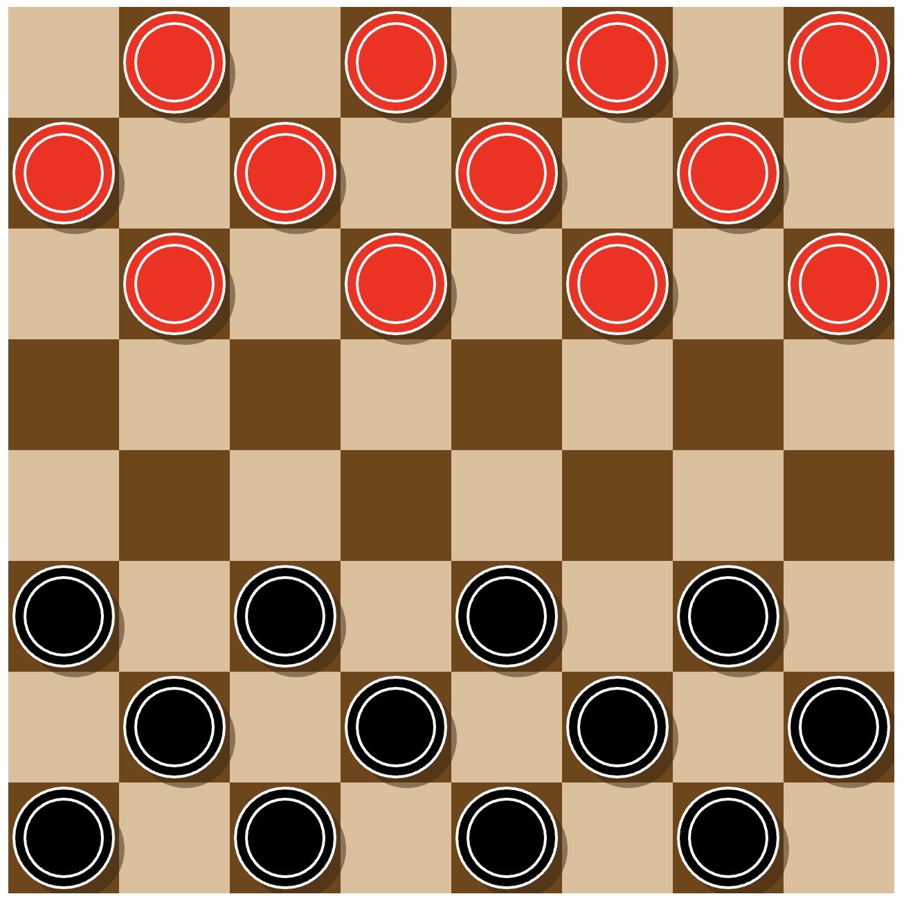

# Checker Board Game
Play the classic game of Checkers with a computer player 💻

👀 Read more about Checkers: https://en.wikipedia.org/wiki/Checkers

## Installation
1. Download Proceesing: https://processing.org/
2. Clone this repo
3. Run `checker_game.pyde` in Processing

## Game Interface

